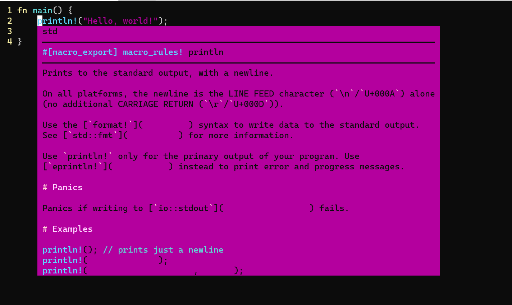

この記事は [sadnessOjisan Advent Calendar 2021](https://adventar.org/calendars/7015) 9 日目の記事です。

最近諸事情で Win, Ubuntu で開発をしているため開発環境を引っ越しています。
仕事が Mac なので毎日 3OS を切り替えて生活しており、VSC のバインドが覚えられなくて苦しんでいます。そこで OS ごとにエディタの挙動が少ないエディタとして Vim を使おうと思い、Vim に Rust の開発環境を作りはじめました。
neovim が最近公式で LSP Client になったためそれを使っているのですが、それと rust-analyzer を接続でハマったので記事にしました。

## neovim の設定

neovim/lsp-config で設定します。こうなりました。

```
call plug#begin('~/.vim/plugged')
Plug 'neovim/nvim-lspconfig'
call plug#end()

" nvim-lsp-config
lua << EOF
local nvim_lsp = require('lspconfig')
local on_attach = function(client, bufnr)
  buf_set_option('omnifunc', 'v:lua.vim.lsp.omnifunc')
  -- See `:help vim.lsp.*` for documentation on any of the below functions
  buf_set_keymap('n', 'gd', '<cmd>lua vim.lsp.buf.definition()<CR>', opts)
  buf_set_keymap('n', 'K', '<cmd>lua vim.lsp.buf.hover()<CR>', opts)
end

local servers = { 'rust_analyzer', 'tsserver', 'ccls' }
EOF
```

さて、これを実行すると、

> rust-analyzer is not found

的なエラーが出ました。
どうやら LSP Client がアクセスする Language Server が無いようです。

なのでインストールしましょう。
公式サイトを見るとバイナリを自分で落としてくる方法と、rustup で落としてくる方法があることを確かめました。rust-analyzer は頻繁に更新されることを知っていたので、rustup 経由で更新できるよう rustup で落としてきます。

```
rustup +nightly component add rust-analyzer-preview
```

さて、rust-analyzer を試してみましょう。

```
rust-analyzer
```

command not found とエラーが出ました。
DL したのに見つかりません、どういうことでしょうか。

## なぜ rust-analyzer が見つからないか

rustup を最初にインストールしたとき、

```
source ~/.cargo/env
```

というコマンドをしたと思うのですが、それが関係します。

あのコマンドは、

```sh
#!/bin/sh
# rustup shell setup
# affix colons on either side of $PATH to simplify matching
case ":${PATH}:" in
    *:"$HOME/.cargo/bin":*)
        ;;
    *)
        # Prepending path in case a system-installed rustc needs to be overridden
        export PATH="$HOME/.cargo/bin:$PATH"
        ;;
esac
```

を実行したことになっており、

`~/.cargo/bin` へのパスを通しています。

そしてここには

```sh
rustup component add xxx
```

で入れたツールが入ることとなります。

```sh
❯ ls ~/.cargo/bin
cargo      cargo-clippy  cargo-miri  cargo-set-version  clippy-driver  rust-gdb   rustc    rustfmt
cargo-add  cargo-fmt     cargo-rm    cargo-upgrade      rls            rust-lldb  rustdoc  rustup
```

しかし、上の出力にある通り、rust-analyzer はここに入っていません。

そう、実は rust-analyzer はここに入らないのです。
つまり rust-analyzer は最初に通したパスに含まれていなかったのです。
これに関しては Issue にもなっていますが、意図しての挙動のようです。

FYI: https://github.com/rust-lang/rustup/issues/2411#issuecomment-656519117

## rust-analyzer にパスを通そう

そこで rust-analyzer にパスを通す方法を考えます。
そもそもどこに保存されているのかを調べてみましょう。

```sh
❯ rustup show
Default host: x86_64-unknown-linux-gnu
rustup home:  /root/.rustup

installed toolchains
--------------------

stable-x86_64-unknown-linux-gnu
nightly-x86_64-unknown-linux-gnu (default)

active toolchain
----------------

nightly-x86_64-unknown-linux-gnu (default)
rustc 1.59.0-nightly (0fb1c371d 2021-12-06)
```

どうやら、`/root/.rustup` というフォルダがあるようなのでここを見てみましょう。
それっぽいフォルダがあるので中を見てます。

```
❯ ls ~/.rustup/toolchains/nightly-x86_64-unknown-linux-gnu/bin/
cargo  cargo-clippy  cargo-fmt  clippy-driver  rust-analyzer  rust-gdb  rust-gdbgui  rust-lldb  rustc  rustdoc  rustfmt
```

ありました、rust-analyzer です。では、ここにパスを通しましょう。

```sh
# 筆者はfishユーザー（激ウマギャグ）
fish_add_path /root/.rustup/toolchains/nightly-x86_64-unknown-linux-gnu/bin
```

そして vim から LSP Server に繋がるか見てみましょう。



繋がりました。
